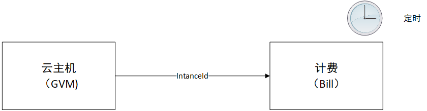
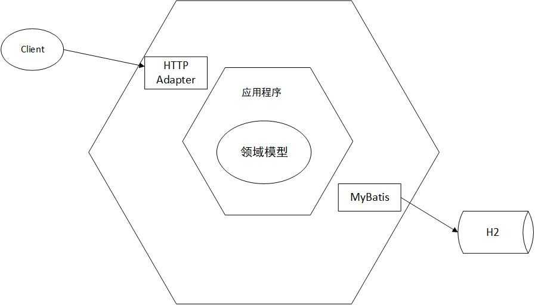

# Day1-我们需要一个计费系统

## 背景

* 高大云以前是一个VPS厂商，最近正准备进军云计算领域，扩展自己的业务范围。
* Dave是这家公司的产品经理。
* Michael是计费系统的负责人。

> 后续story有特殊部分才会介绍背景。

## 需求

* Dave: Hi, Michael.我们公司正在云计算领域进行探索，需要一个计费系统。
* Michael: 啥？云计算？为什么需要计费系统？
* Dave: 公司准备做公有云，提供云主机服务给用户使用，需要对这些云主机进行计费。
* Michael: 卖VPS就卖VPS，偏要说搞云计算。
* Dave: 云计算最近不是火吗，说是搞云计算的好圈钱。话不多说，我们需要对这些云主机进行按量计费，
到小时级别就可以了。
* Michael: 哦，知道了。我考虑下。

## 需求分析

给云主机计费，这简单啊！每个小时候收多收钱是固定的，只要云主机在我就计费，删除了我就不计费了。

很快，Michael划出了以下的系统架构图。

当用户创建云主机时，通知一下计费系统。当用户删除云主机时，也通知一下。只要云主机存在，就每个小时计算一次。
看上去这个问题不复杂。但是复杂的问题都是从简单的需求演化而来的，Michael决定还是一开始就采用DDD架构，以免
后期遇到神马麻烦。

## 代码架构

Michael决定采用DDD中经典的六边形架构来组织计费的代码结构。显然，针对目前的需求，使用六边形架构有点杀鸡
用牛刀的意思，但是为了减少后面的重构的风险，他还是决定使用这套架构。至于是否使用多module，Michael决定
先使用不采用多Module结构，通过划分package来区分层次，这样后面真的需要划module也会更平滑一些。

## 重点代码解析

todo

## 记录版本

todo

